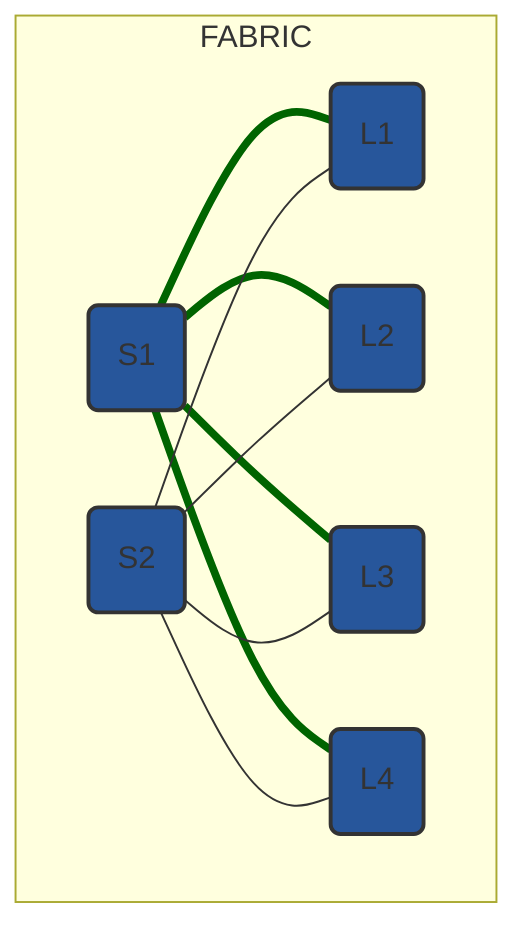
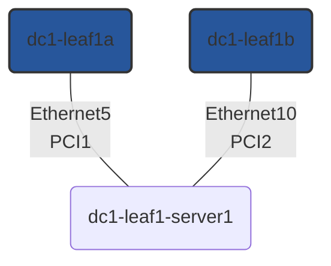
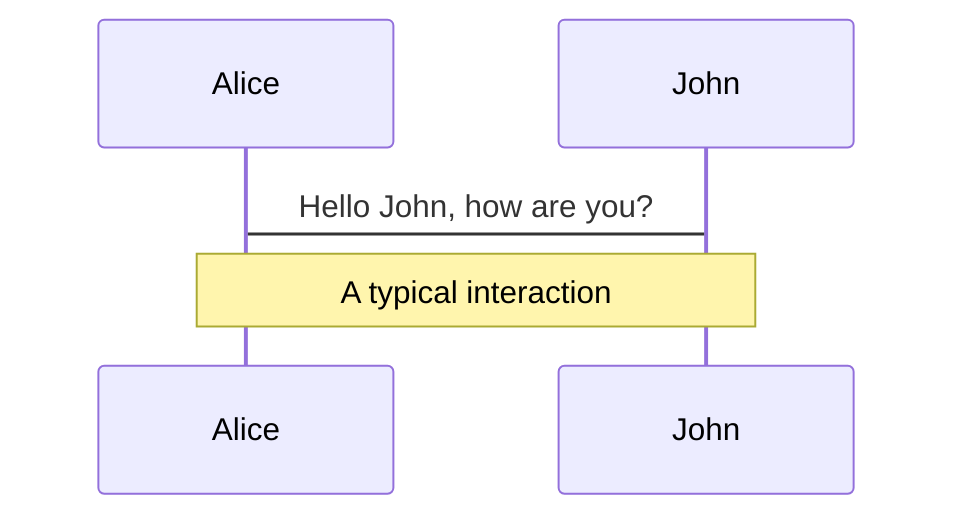
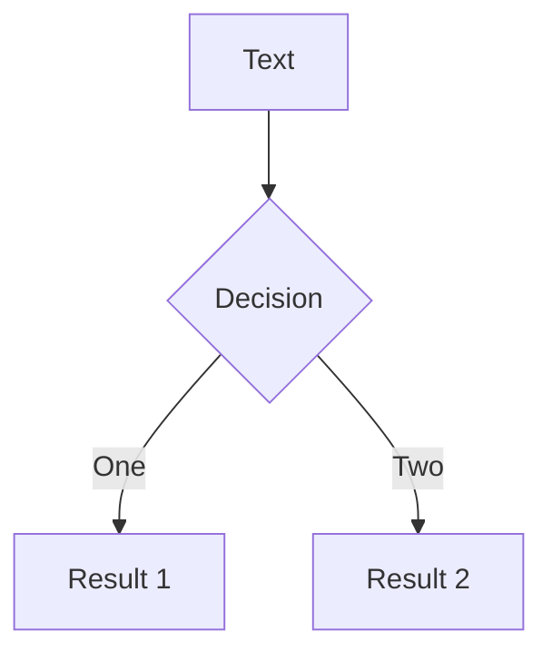

---
# try also 'default' to start simple
theme: purplin
# background: https://unsplash.com/photos/fX-qWsXl5x8
# apply any windi css classes to the current slide
class: 'text-center'
# https://sli.dev/custom/highlighters.html
highlighter: prism
# show line numbers in code blocks
lineNumbers: false
# some information about the slides, markdown enabled
info: |
  ## Slidev Starter Template
  Presentation slides for developers.

  Learn more at [Sli.dev](https://sli.dev)
# persist drawings in exports and build
drawings:
  persist: false
# use UnoCSS
css: unocss
exportFilename: 'af-2022'
colorSchema: 'dark'
favicon: '/favicon.ico'
---

# Automating Arista Network Fabric

<BarBottom  title="AnsibleFest 2022" >
  <Item text="aristanetworks/ansible-avd">
    <carbon:logo-github />
  </Item>
  <Item text="@AristaNetworks">
    <carbon:logo-twitter />
  </Item>
  <Item text="arista.com">
    <carbon:globe />
  </Item>
</BarBottom>

---

# What is Arista Validated Design (AVD)?

An extensible data model that defines Arista’s Unified Cloud Network (UCN) architecture as “code”

## Benefits

<br>

- Automatic generation of documentation and validation tests <mdi-notes />
- Foundation for Infrastructure-as-Code <mdi-terminal />
- Faster time to production <mdi-timer />
- Reduced risk of configuration error <mdi-mood />
- Consistent global configuration changes across the network <mdi-check-box />

<BarBottom  title="AnsibleFest 2022">
  <Item text="aristanetworks/ansible-avd">
    <carbon:logo-github />
  </Item>
  <Item text="@AristaNetworks">
    <carbon:logo-twitter />
  </Item>
  <Item text="arista.com">
    <carbon:globe />
  </Item>
</BarBottom>

---

# How

<br>
<br>

<div grid="~ cols-3 gap-2" m="-t-3">

```yaml {all|3}
# Fabric/Host variables
underlay_routing_protocol: EBGP
bgp_as: 65001
```

```yaml {all|2-3}
# Structured configuration
router_bgp:
  as: 65001
  address_family_ipv4:
    peer_groups:
      UNDERLAY-PEERS:
        active: true
```

```jinja2 {all|2,4}
{# eos - Router BGP #}

!
router bgp {{ router_bgp.as }}
```

```text {all|2}
# EOS CLI
router bgp 65001
   address-family ipv4
      neighbor UNDERLAY-PEERS activate
```

</div>

<BarBottom  title="AnsibleFest 2022">
  <Item text="aristanetworks/ansible-avd">
    <carbon:logo-github />
  </Item>
  <Item text="@AristaNetworks">
    <carbon:logo-twitter />
  </Item>
  <Item text="arista.com">
    <carbon:globe />
  </Item>
</BarBottom>

---

# Automated documentation

### Point-To-Point Links Node Allocation

| Node | Node Interface | Node IP Address | Peer Node | Peer Interface | Peer IP Address |
| ---- | -------------- | --------------- | --------- | -------------- | --------------- |
| dc1-leaf1a | Ethernet1 | 10.255.255.1/31 | dc1-spine1 | Ethernet1 | 10.255.255.0/31 |
| dc1-leaf1a | Ethernet2 | 10.255.255.3/31 | dc1-spine2 | Ethernet1 | 10.255.255.2/31 |
| dc1-leaf1b | Ethernet1 | 10.255.255.5/31 | dc1-spine1 | Ethernet2 | 10.255.255.4/31 |
| dc1-leaf1b | Ethernet2 | 10.255.255.7/31 | dc1-spine2 | Ethernet2 | 10.255.255.6/31 |

<BarBottom  title="AnsibleFest 2022">
  <Item text="aristanetworks/ansible-avd">
    <carbon:logo-github />
  </Item>
  <Item text="@AristaNetworks">
    <carbon:logo-twitter />
  </Item>
  <Item text="arista.com">
    <carbon:globe />
  </Item>
</BarBottom>

---
layout: center
---

# Group variables

<BarBottom  title="AnsibleFest 2022">
  <Item text="aristanetworks/ansible-avd">
    <carbon:logo-github />
  </Item>
  <Item text="@AristaNetworks">
    <carbon:logo-twitter />
  </Item>
  <Item text="arista.com">
    <carbon:globe />
  </Item>
</BarBottom>

---
layout: two-cols
---
# Fabric wide definitions

<br>

```yaml
# FABRIC.yml
underlay_routing_protocol: EBGP
overlay_routing_protocol: EBGP

local_users:
  ansible:
    privilege: 15
    role: network-admin
  admin:
    privilege: 15
    role: network-admin
```

::right::

# | Topology

<br>



<BarBottom  title="AnsibleFest 2022">
  <Item text="aristanetworks/ansible-avd">
    <carbon:logo-github />
  </Item>
  <Item text="@AristaNetworks">
    <carbon:logo-twitter />
  </Item>
  <Item text="arista.com">
    <carbon:globe />
  </Item>
</BarBottom>

---
layout: two-cols
---
# Network services

- Tenants
- L3 & L2 services

::right::

<br>
<br>

```yaml
---
# NETWORK_SERVICES.yml
tenants:
  TENANT1:
    mac_vrf_vni_base: 10000
    vrfs:
      VRF10:
        vrf_vni: 10
        svis:
          "11":
            name: VRF10_VLAN11
            enabled: true
            ip_address_virtual: 10.10.11.1/24
    l2vlans:
      "3401":
        name: L2_VLAN3401
      "3402":
        name: L2_VLAN3402
```

<BarBottom  title="AnsibleFest 2022">
  <Item text="aristanetworks/ansible-avd">
    <carbon:logo-github />
  </Item>
  <Item text="@AristaNetworks">
    <carbon:logo-twitter />
  </Item>
  <Item text="arista.com">
    <carbon:globe />
  </Item>
</BarBottom>

---
layout: two-cols
---
# Connected endpoints

<br>

```yaml {all|7-9}
---
# CONNECTED_ENDPOINTS.yml
servers:
  dc1-leaf1-server1:
    adapters:
    - type: server
      server_ports: [ PCI1, PCI2 ]
      switch_ports: [ Ethernet5, Ethernet10 ]
      switches: [ dc1-leaf1a, dc1-leaf1b ]
      vlans: 11-12,21-22
      native_vlan: 4092
      mode: trunk
      spanning_tree_portfast: edge
      port_channel:
        description: PortChannel dc1-leaf1-server1
        mode: active
```

::right::

# | Topology

<br>



<BarBottom  title="AnsibleFest 2022">
  <Item text="aristanetworks/ansible-avd">
    <carbon:logo-github />
  </Item>
  <Item text="@AristaNetworks">
    <carbon:logo-twitter />
  </Item>
  <Item text="arista.com">
    <carbon:globe />
  </Item>
</BarBottom>

---

# Ansible AVD Collection

### Keyboard Shortcuts

|     |     |
| --- | --- |
| <kbd>right</kbd> / <kbd>space</kbd>| next animation or slide |
| <kbd>left</kbd>  / <kbd>shift</kbd><kbd>space</kbd> | previous animation or slide |
| <kbd>up</kbd> | previous slide |
| <kbd>down</kbd> | next slide |

<!-- https://sli.dev/guide/animations.html#click-animations -->

<p v-after class="absolute bottom-23 left-45 opacity-30 transform -rotate-10">Here!</p>

---

# Code

<div grid="~ cols-2 gap-2">

```ts {all|2|1-6|9|all}
interface User {
  id: number
  firstName: string
  lastName: string
  role: string
}

function updateUser(id: number, update: User) {
  const user = getUser(id)
  const newUser = { ...user, ...update }
  saveUser(id, newUser)
}
```

```yaml
---
all:
  children:
    cv_servers:
      hosts:
        cv_atd1:
          ansible_host: 192.168.0.5
          ansible_user: arista
          ansible_password: # update password with "Lab Credentials"
          cv_collection: v3
```

</div>

---
class: px-20
---

# Themes

Slidev comes with powerful theming support. Themes can provide styles, layouts, components, or even configurations for tools. Switching between themes by just **one edit** in your frontmatter:

<div grid="~ cols-2 gap-2" m="-t-2">

```yaml
---
theme: default
---
```

```yaml
---
theme: seriph
---
```

</div>

Read more about [How to use a theme](https://sli.dev/themes/use.html) and
check out the [Awesome Themes Gallery](https://sli.dev/themes/gallery.html).

---

# Diagrams

You can create diagrams / graphs from textual descriptions, directly in your Markdown.

<div class="grid grid-cols-2 gap-10 pt-4 -mb-6">





</div>

---
layout: center
class: text-center
---

# Thank you

[Documentation](https://avd.sh/en/stable/) · [GitHub](https://github.com/aristanetworks/ansible-avd) · [Showcases](https://sli.dev/showcases.html)
