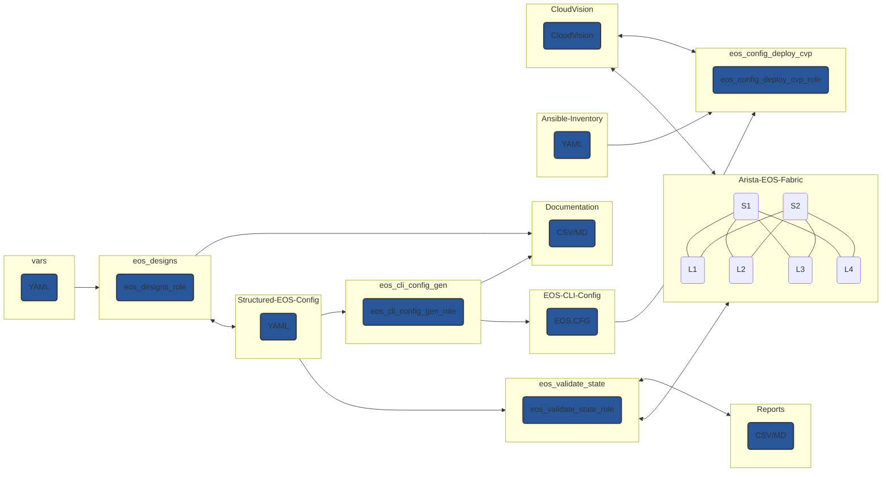
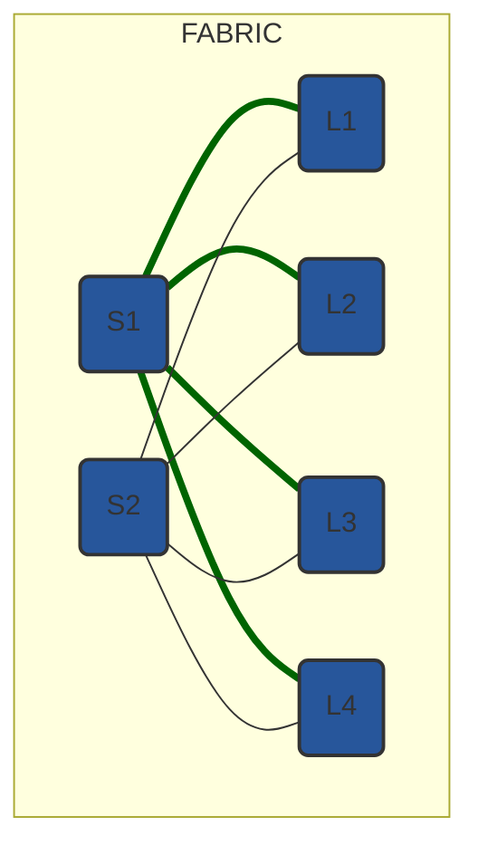
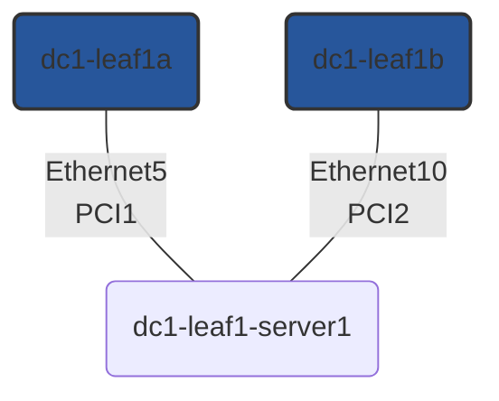

---
# try also 'default' to start simple
theme: default
# background: https://unsplash.com/photos/fX-qWsXl5x8
# apply any windi css classes to the current slide
class: 'text-center'
# https://sli.dev/custom/highlighters.html
highlighter: prism
# show line numbers in code blocks
lineNumbers: false
# some information about the slides, markdown enabled
info: |
  ## Slidev Starter Template
  Presentation slides for developers.

  Learn more at [Sli.dev](https://sli.dev)
# persist drawings in exports and build
drawings:
  persist: false
# use UnoCSS
css: unocss
exportFilename: 'af-2022'
colorSchema: 'dark'
favicon: '/favicon.ico'
---

# TEST

---
layout: center
---

# Automating Arista Network Fabric

---

# What is Arista Validated Design (AVD)?

An extensible data model that defines Arista’s Unified Cloud Network (UCN) architecture as “code”

## Benefits

<br>

- Automatic generation of documentation and validation tests 😊
- Foundation for Infrastructure-as-Code <mdi-terminal />
- Faster time to production <mdi-timer />
- Reduced risk of configuration error <mdi-mood />
- Consistent global configuration changes across the network <mdi-check-box />

---
layout: iframe-right
url: https://avd.sh/en/devel/index.html
---

# AVD Ansible Collection

- [avd.sh](https://avd.sh/en/stable/)

---
layout: center
---

# Role breakdown



---

# The oversimplification

<br>
<br>

<div grid="~ cols-3 gap-2" m="-t-3">

```yaml {all|3}
# Fabric/Host variables
underlay_routing_protocol: EBGP
bgp_as: 65001
```

```yaml {all|2-3}
# Structured configuration
router_bgp:
  as: 65001
  address_family_ipv4:
    peer_groups:
      UNDERLAY-PEERS:
        active: true
```

```jinja2 {all|2,4}
{# eos - Router BGP #}

!
router bgp {{ router_bgp.as }}
```

```text {all|2}
# EOS CLI
router bgp 65001
   address-family ipv4
      neighbor UNDERLAY-PEERS activate
```

</div>

---
layout: center
---

# Group variables

---
layout: two-cols
---
# Fabric wide definitions

<br>

```yaml
# FABRIC.yml
underlay_routing_protocol: EBGP
overlay_routing_protocol: EBGP

local_users:
  ansible:
    privilege: 15
    role: network-admin
  admin:
    privilege: 15
    role: network-admin
```

::right::

<br>
<br>
<br>



---
layout: two-cols
---
# Network services

- Tenants
- L2 & L3 services

::right::

<br>
<br>

```yaml
---
# NETWORK_SERVICES.yml
tenants:
  TENANT1:
    mac_vrf_vni_base: 10000
    vrfs:
      VRF10:
        vrf_vni: 10
        svis:
          "11":
            name: VRF10_VLAN11
            enabled: true
            ip_address_virtual: 10.10.11.1/24
    l2vlans:
      "3401":
        name: L2_VLAN3401
      "3402":
        name: L2_VLAN3402
```

---
layout: two-cols
---
# Connected endpoints

<br>

```yaml {all|7-9}
---
# CONNECTED_ENDPOINTS.yml
servers:
  dc1-leaf1-server1:
    adapters:
    - type: server
      server_ports: [ PCI1, PCI2 ]
      switch_ports: [ Ethernet5, Ethernet10 ]
      switches: [ dc1-leaf1a, dc1-leaf1b ]
      vlans: 11-12,21-22
      native_vlan: 4092
      mode: trunk
      spanning_tree_portfast: edge
      port_channel:
        description: PortChannel dc1-leaf1-server1
        mode: active
```

::right::

<br>
<br>
<br>



---
layout: center
---

# Lab

---
layout: center
class: text-center
---

# Thank you

[Documentation](https://avd.sh/en/stable/) · [GitHub](https://github.com/aristanetworks/ansible-avd) · [Community examples](https://github.com/arista-netdevops-community)
